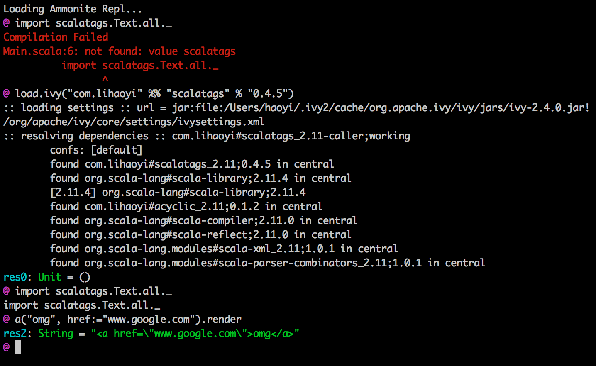
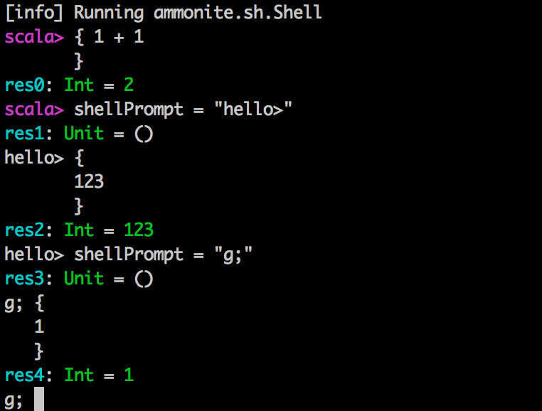
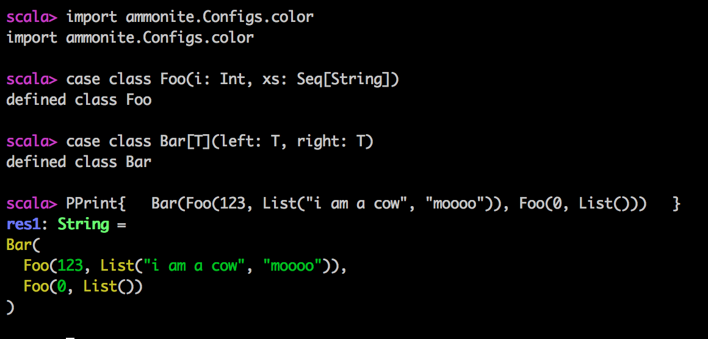
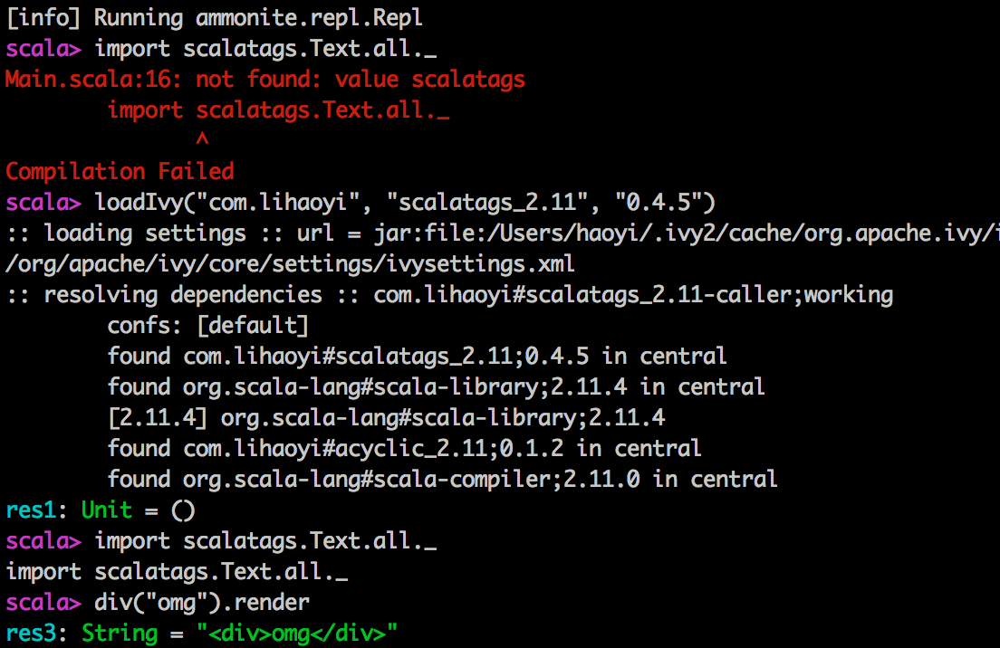
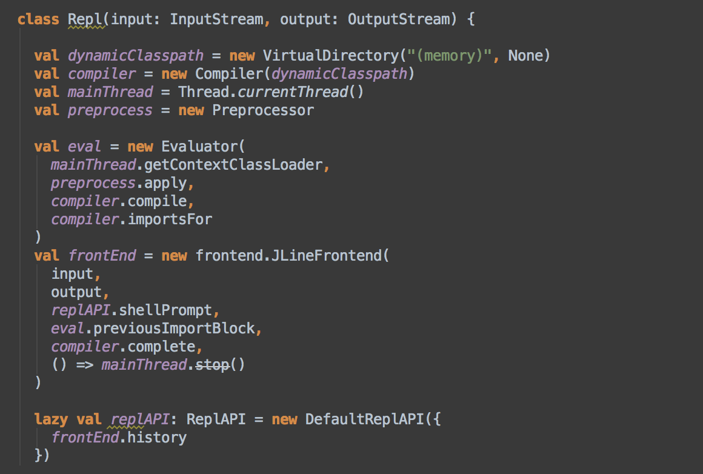

Ammonite 0.2.3
==============

```scala
import ammonite.all._

// Get the current working directory
val wd = processWorkingDir

// Make a folder named "folder1"
mkdir! wd/'folder1

// List the current directory
ls! wd

// Copy a file or folder
cp(wd/'folder1, wd/'folder2)

// Write to a file without pain!
write(wd/'folder2/"file1.scala", "Hello")
write(wd/'folder2/"file2.scala", "Hello")

// Rename all .scala files inside the folder d into .java files
ls! wd/'folder2 | mv{case r"$x.scala" => s"$x.java"}

// List files in a folder
ls! wd/'folder2

// Line-count of all .scala files recursively in d
ls.rec! wd |? (_.ext == "scala") | read.lines | (_.size) sum

// Find and concatenate all .js files directly in the working directory
ls! wd |? (_.ext == "js") | read |> write! wd/'target/"bundle.js"
```

Ammonite is a library used to write rock-solid [shell scripts](http://en.wikipedia.org/wiki/Shell_script) using Scala. It provides a very lightweight way to perform common system housekeeping operations in Scala, without having to drop down to sketchy, fragile [Bash](http://en.wikipedia.org/wiki/Bash_%28Unix_shell%29) scripts. Ammonite aims to be safe enough to use large programs while concise enough to use from the Scala command-line.

In general, a Ammonite command to do a particular action should be not-much-longer than the equivalent Bash command, but it is far safer due to Scala's type-safe nature and design principles (immutability, no-global-state, etc.). Ammonite also can serve as Scala's missing IO library, serving to replace the [common mess of boilerplate](http://stackoverflow.com/a/26769030/871202):

```scala
def removeAll(path: String) = {
  def getRecursively(f: File): Seq[File] =
    f.listFiles.filter(_.isDirectory).flatMap(getRecursively) ++ f.listFiles
  getRecursively(new File(path)).foreach{f =>
    if (!f.delete())
      throw new RuntimeException("Failed to delete " + f.getAbsolutePath)}
  }
removeAll("target/thing")
```

With single, sleek command:

```scala
// Remove a file or folder target/thing
rm! wd/'target/'thing
```

Getting Started
===============

To begin, add the following to your build.sbt:

```scala
"com.lihaoyi" %% "ammonite-ops" % "0.2.3",
```

Then at the top of your file,

```scala
import ammonite.ops._
```

And you're all set!

Paths
=====

Ammonite uses strongly-typed data-structures to represent filesystem paths. The two basic versions are:

- `Path`: an absolute path, starting from the root
- `RelPath`: a relative path, not rooted anywhere

Generally, almost all commands take absolute `Path`s. Absolute paths can be created in a few ways:

```scala
// Get the process' working directory
val wd = processWorkingDir

// A path nested inside `wd`
wd/'folder/'file

// A path starting from the root
root/'folder/'file

// A path with spaces or other special characters
wd/"My Folder"/"My File.txt"

// Up one level from the wd
wd/up

// Up two levels from the wd
wd/up/up
```

Note that there are no in-built operations to change the `processWorkingDir`. You can of course do so using Java APIs, but in general you should not need to. Simply defining a new path, e.g.

```scala
val target = wd/'target
```

Should be sufficient for most needs. Two absolute `Path`s are pre-defined:

- `processWorkingDir`: the current working directory of your process. Note this can change over time, and `processWorkingDir` always reflects the current value. This is intentionally verbose so you don't use it too much; you should use `val wd = processWorkingDir` once at the start of your program and pass `wd` where ever necessary.
- `root`: the root of the filesystem, traditionally represented as `/`


RelPaths
========

Relative `RelPath`s can be created in the following ways:

```scala
// The path "folder/file"
'folder/'file
'folder/'file

// The path "file"
rel/'file

// The relative difference between two paths
val target = wd/'target/'file
(target - wd) // same as 'target/'file or "target/file"

// `up`s get resolved automatically
(wd - target) // same as up/up or "../.."
```

In general, very few APIs take relative paths. Their main purpose is to be combined with absolute paths in order to create new absolute paths. e.g.

```scala
val target = wd/'target/'file
val rel = target - wd
val newBase = root/'code/'server
newBase/rel // root/'code/'server/'target/'file
```

`up` is a relative path that comes in-built:

```scala
val target = root/'target/'file
target/up // root/'target
```

Note that all paths are always expressed in a canonical manner:

```scala
(root/'folder/'file/up).toString
"/folder"
// not "/folder/file/.."

('folder/'file/up).toString
"folder"
// not "folder/file/.."
```

So you don't need to worry about canonicalizing your paths before comparing them for equality or otherwise manipulating them. 

Extensions
==========

Ammonite comes with a bunch of extension methods that make everything much more concise. These turn Scala from a "relatively-concise" language into one as tight as Bash scripts, while still maintaining the high level of type-safety and maintainability that comes with Scala code.

Extensions of `Traversable`
---------------------------

These extensions apply to any `Traversable`: `Seq`s, `List`s, `Array`s, and others.

- `things | f` is an alias for `things map f`
- `things || f` is an alias for `things flatMap f`
- `things |? f` is an alias for `things filter f`
- `things |& f` is an alias for `things reduce f`

These should behave exactly the same as their implementations; their sole purpose is to make things more concise at the command-line.

`Pipeable`
----------

Ammonite brings with it the `|>` operator on all values, defined as:

```scala
implicit class Pipeable[T](t: T){
  def |>[V](f: T => V) = f(t)
}
```

It basically lets you write `a |> b` rather than `b(a)`. It does nothing more

Operations
==========

Ammonite comes with a set of built-in operations that mirrors much of what you could do in the Bash shell. The naming is similar, to what you'd use in Bash, except you call them via `op! arg` or `op(arg)` or `op(arg1, arg2)` instead of `op arg` and `op arg1 arg2` that you'd see in Bash.


```scala
// Make a directory
mkdir! wd/'folder

// Move it
mv(wd/'folder, wd/'folder2)

// Copy it; recursive by default
cp(wd/'folder2, wd/'folder3)

// List the files in wd
ls! wd

// List the files in wd recursively
ls.rec! wd

// Remove one of them; recursive by default
rm! wd/'folder2

// Write a file, if it doesn't exist
write(wd/'folder2/"data.txt", "I am a cow")

// Write to a file, stomping over anything that exists
write.over(wd/'folder2/"data.txt", "I am a cow")

// Append to a file
write.append(wd/'folder2/"data.txt", "I am a cow")

// Read a file as a String
read! wd/'folder2/"data.txt"

// Read a file as an Iterator[String]
read.lines! wd/'folder2/"data.txt"

// Read a file as an Array[Byte]
read.bytes! wd/'folder2/"data.bin"

// Check if a file or folder exists
exists! wd/'folder2/"data.txt"

// Search for all files with the text "Eval" in them
import ammonite.pprint.Config.Defaults._
ls.rec! wd | grep! "Eval"

// Search for all lines in .scala files with the text "Eval" in them
import ammonite.pprint.Config.Defaults._
ls.rec! wd |? (_.ext == "scala") || read.lines |? grep! "Eval"

// All lines in all scala files which contain symbol literals
 ls.rec! wd |? grep! ".*scala" || read.lines |? grep! "'[a-zA-Z0-9_]+".r
```

All of these operations are pre-defined and strongly typed, so feel free to jump to their implementation to look at what they do or what else is available.

In general, each operator has sensible/safe defaults: 

- `rm` and `cp` are recursive
- `rm` ignores the file if it doesn't exist
- all operations that create a file or folder (`mkdir`, `write`, `mv`) automatically create any necessary parent directories
- `write` also does *not* stomp over existing files by default. You need to use `write.over`

In general, this should make these operations much easier to use; the defaults should cover the 99% use case without needing any special flags or fiddling.

Chains
======

The real value of Ammonite is the fact that you can pipe things together as easily as you could in Bash. No longer do you need to write reams of boilerplate. to accomplish simple tasks. Some of these chains are listed at the top of this readme, here are a few more fun examples:

```scala
// Move all files inside the "py" folder out of it
ls! wd/"py" | mv.all*{case d/"py"/x => d/x }

// Find all dot-files in the current folder
ls! wd |? (_.last(0) == '.')

// Find the names of the 10 largest files in the current working directory
ls.rec! wd | (x => x.size -> x) sortBy (-_._1) take 10

// Sorted list of the most common words in your .scala source files
def txt = ls.rec! wd |? (_.ext == "scala") | read
def frequencies(s: Seq[String]) = s groupBy (x => x) mapValues (_.length)
txt || (_.split("[^a-zA-Z0-9_]")) |> frequencies |> (_.toSeq) sortBy (-_._2)
```

Each of these would be a significant amount of ugly filesystem traversals, readings, and other operations. With Ammonite, it is often a single line.

Pretty Printing
===============

Ammonite comes with a pretty-printing module, which lets you easily print data structures in a readable way:

```scala
scala> import ammonite.pprint._
scala> import Config.Defaults._

scala> PPrint(
  List(Seq(Seq("mgg", "mgg", "lols"), Seq("mgg", "mgg")), Seq(Seq("ggx", "ggx"),Seq("ggx", "ggx", "wtfx")))
)
res33: String =
List(
  List(List("mgg", "mgg", "lols"), List("mgg", "mgg")),
  List(List("ggx", "ggx"), List("ggx", "ggx", "wtfx"))
)
```

Note how every string is escaped, everything is laid out nicely, and the output is in a state that you can easily copy & paste it back into the REPL to evaluate.

You can also use

```scala
import Configs.Colors._
```

Instead of `Defaults` in order to turn on colored pretty-printing.

Pretty-printing is by default defined for most standard library types, as well as case classes and case objects. For other types not supported, it falls back to using `toString`

```scala
scala> PPrint(new Object())
res35: String = java.lang.Object@54f880c0
```

In order to pretty print a type `T`, you need to have a `T: PPrint` context bound present. In order to write your own custom pretty printer for some type `T`, provide a `PPrinter[T]`.

Limitations
===========

While Ammonite is an excellent filesystem API, and can turn your Scala/SBT console into a usable shell, it has some limitations

- **No process isolation**: the Scala shell runs in-process, so a single infinite loop or bad command can bring it down and make you lose your work.
- **No streaming**: all actions in Ammonite are eager, and aggregate all results before returning you concrete Vectors. That means a large command could pause for long periods before you see any activity (only when it completes).
- **Awkward syntax**: while arguably less awkward than Bash, Scala has some annoyances such as mandatory curly-braces for partial functions, or the precedence rules for chaining operators not behaving as you'd like.
- **An o-k REPL**: Scala's command line interpreter is no-where near as nice as [IPython](http://ipython.org/). We'd need features like Color, pretty-printed output, better multi-line support, and others to compete.
- **No concurrency story**: None of Ammonite's operations are multi-thread or multi-process safe. For example, recursively deleting a folder could fail if some other process is at the same time writing new files into it. This is not any worse than Bash or other shells, but differs from most idiomatic Scala programs which tend to be safer than this.

Ammonite REPL
=============

The Ammonite REPL is a work-in-progress, cleanroom re-implementation of the Scala REPL from first principles. It aims create a codebase much more structured than that of `scala.tools.nsc.interpreter`, and thus being able to move faster and support more features.

To try out the REPL, add the following to your build.sbt

```scala
libraryDependencies += "com.lihaoyi" %% "ammonite-repl" % "0.2.3" % "test"

initialCommands in console := "ammonite.repl.Repl.main(null)"

scalaVersion := "2.11.5"
```

After that, simple hit

```
sbt projectName/test:console
```

To activate the Ammonite REPL. The REPL is a work-in-progress, so expect to find a few rough edges. Ammonite already supports many more features than the default Scala REPL, including:

- Loading jars directly from Maven Central into the REPL



- Colored, customizable prompts



- Pretty-printed, *colored*, valid-scala C&P-able output for commands



- Loading jar files or ivy-coordinates directly into the REPL



- Replaceable compilers: throw-away/crash your copy of the compiler and get a new one without missing a beat.

- Interruptable commands using `Ctrl-C`

Builtins
--------

Ammonite contains a rNange of useful built-ins implemented as normal functions. Everything inside the `ReplAPI` trait is imported by default and can be accessed directly by default to control the console.

```scala
trait ReplAPI {
  /**
   * Exit the Ammonite REPL. You can also use Ctrl-D to exit
   */
  def exit = throw ReplExit

  /**
   * Clears the screen of the REPL
   */
  def clear: Unit

  /**
   * Read/writable prompt for the shell. Use this to change the
   * REPL prompt at any time!
   */
  var shellPrompt: String

  /**
   * Display this help text
   */
  def help: String

  /**
   * History of commands that have been entered into the shell
   */
  def history: Seq[String]

  /**
   * Get the `Type` object of [[T]]
   */
  def typeOf[T: WeakTypeTag]: Type

  /**
   * Get the `Type` object representing the type of `t`
   */
  def typeOf[T: WeakTypeTag](t: => T): Type

  /**
   * Tools related to loading external scripts and code into the REPL
   */
  def load: Load

  /**
   * Throw away the current scala.tools.nsc.Global and get a new one
   */
  def newCompiler(): Unit

  /**
   * Controls how things are pretty-printed in the REPL. Feel free
   * to shadow this with your own definition to change how things look
   */
  implicit def pprintConfig: ammonite.pprint.Config
}
trait Load extends (String => Unit){
  /**
   * Load a `.jar` file
   */
  def jar(jar: java.io.File): Unit
  /**
   * Load a library from its maven/ivy coordinates
   */
  def ivy(coordinates: (String, String, String)): Unit

  /**
   * Loads a command into the REPL and
   * evaluates them one after another
   */
  def apply(line: String): Unit
}
```

Internals
---------

Ammonite is able to support many more features due to its architecture, which eschews complex cake in favor of good old object-composition and monad composition. In particular:

- Sub-components of the REPL (compiler, jline, repl APIs, etc.) are plain-old-classes, and wired together manually using their constructors. This makes it much easier to see what depends on what:



- Everything is [acyclic](https://github.com/lihaoyi/acyclic)

- The actual evaluation happens in a `ammonite.Result` monad, which encapsulates much out of the short-circuiting nature of the computation, without throwing exceptions.

- No exceptions at all except what is thrown from underlying APIs, and those are caught and wrapped as quickly as possible.

In general, the source code of the Ammonite REPL should be really easy to work with, much more so than that of the default Scala compiler, and with a bit of time should become much more robust and featureful.

Contributions welcome!
